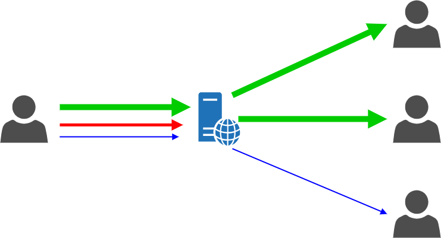
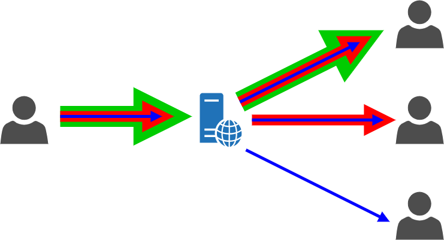
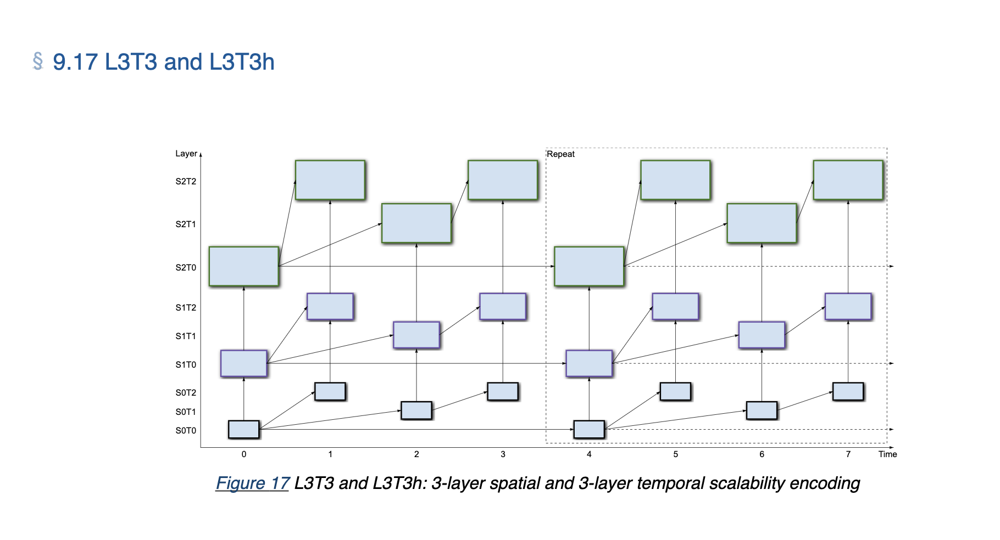

# svc-taco

This repository aims to investigate whether WebCodec's `VideoDecoder` can decode SVC-encoded video frames from WebRTC.

## Background

### Scalable Video Coding (SVC)

Adaptive video streaming is the ability to adapt the video quality to the user's network conditions. Simulcast allows
for adaptive video streaming by independently encoding different versions of a video segment. However, this leads to an
increased storage penalty due to the redundancy.

SVC reduces this redundancy by encoding a video segment into multiple different spatial and
temporal layers. A video segment with the lowest requirements is encoded as the base layer.

| Simulcast                   | SVC               |
|-----------------------------|-------------------|
|  |  |

### Limited Resources

[hypervideo](https://github.com/hypervideo/hyper.video) uses `VideoEncoder` from the `WebCodec` API.
However, `VideoEncoder`'s SVC capabilities is quite limited, as it only supports temporal scalability.

It is well known that WebRTC's video encoder supports both temporal and spatial scalability. WebRTC's most
aggressive [`scalabilityMode`](https://www.w3.org/TR/webrtc-svc/#scalabilitymodes*) with a 2:1 resolution is `L3T3`.
Meaning video segments are encoded into 3 different spatial resolutions and 3 different temporal layers.



### AV1

An [investigation](https://issues.chromium.org/issues/338929751) into the current status of SVC decoding for WebCodecs
showed that the AV1 software decoder outputs the highest spatial layer. This means given an AV1 + SVC="L3T3"
encoded video stream, `VideoDecoder` should be able to decode these video frames.

## Goals

This repository investigates the least invasive way to use WebRTC's media encoding feature and uses `VideoDecoder` to
decode the encoded video frames.

## How to Run

> [!NOTE]  
> When running the demo, make sure to disable cache!

```sh
# this assumes you have Golang and Just installed
# inside project root directory
just run # or go run server.go
```

## Sources

W3C VideoDecoder - https://www.w3.org/TR/webcodecs/#videodecoder-interface

SVC Extension for WebRTC - https://www.w3.org/TR/webrtc-svc/#bib-media-capabilities

Chromium - [temporal-svc.js](https://source.chromium.org/chromium/chromium/src/+/main:third_party/blink/web_tests/external/wpt/webcodecs/temporal-svc-encoding.https.any.js;l=11-15;drc=e0e07506b7fc8a8ddd4e9f7799e8e572a8c57612)

Scalable High Efficiency Video Coding based HTTP Adaptive Streaming over
QUIC - https://dl.acm.org/doi/10.1145/3405796.3405829

AV1 Spec, 6.7.6.12. L3T3 (Informative) - https://aomediacodec.github.io/av1-spec/av1-spec.pdf

## Related Thread

https://github.com/hypervideo/hyper.video/issues/224
